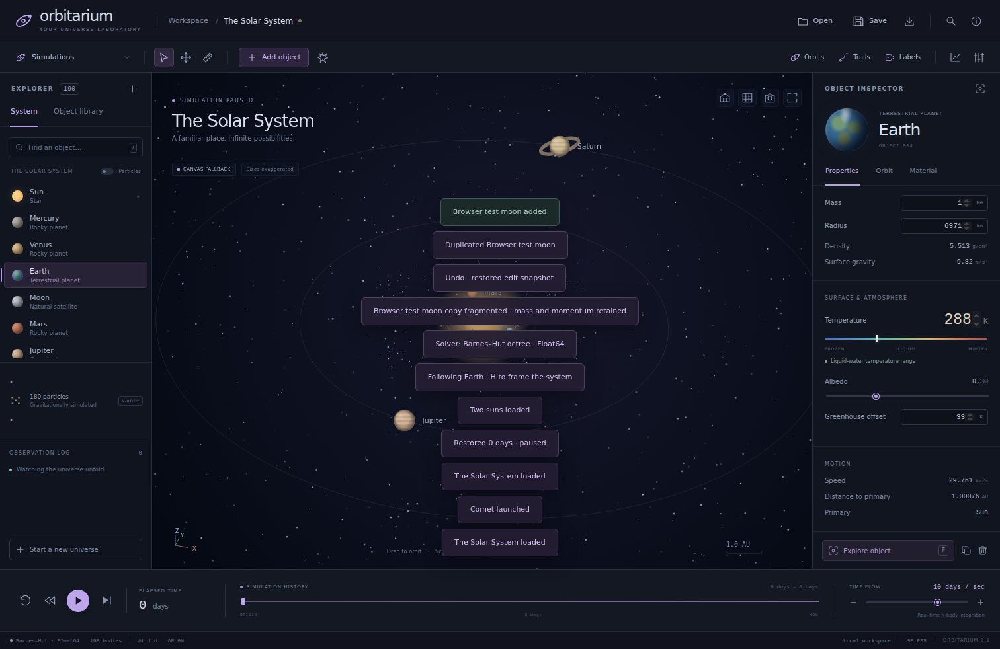

# Orbitarium

**A playable, editable universe laboratory in plain HTML, JavaScript and WGSL.**

[Open Orbitarium](https://wieslawsoltes.github.io/Orbitarium/) · [Build and deployment](https://github.com/wieslawsoltes/Orbitarium/actions) · [Architecture](docs/ARCHITECTURE.md) · [Science and limitations](docs/SCIENCE.md)

Orbitarium 0.1.0 is an original, clean-room gravity sandbox inspired by the category of software exemplified by Universe Sandbox. It is a running simulation and editor, not a screenshot mockup. This release implements the core gravity-sandbox workflow; it does **not** claim feature-for-feature parity with Universe Sandbox.

There are no external runtime libraries, CDN requests, downloaded textures, tracking scripts, accounts, or cloud services. All 12 reusable packages are implemented here, and the browser application imports those packages directly.



## Run locally

Node.js 20 or newer is required for the development server. The delivered application needs no installation or compilation to launch:

```sh
git clone https://github.com/wieslawsoltes/Orbitarium.git
cd Orbitarium
npm start
# Open http://localhost:4173
```

`orbitarium-standalone.html` contains the application, modules, WGSL kernels, stylesheet and icon in a single file. Serve it from localhost or HTTPS for origin-dependent browser capabilities. Do not open the modular `index.html` directly through a `file:` URL.

For package development and tests:

```sh
npm ci --ignore-scripts --no-audit --no-fund
npm run check
npm test
npm run build
node scripts/verify-pages.mjs
```

The build regenerates the standalone HTML and `dist/`. Browser imports use an import map; there is no bundler or transpiler dependency.

## The laboratory

Start with the Solar System: eight planets, the Moon and 180 gravitationally simulated belt particles. Select a body, edit its mass or velocity, add a moon in an initialized Kepler orbit, drag-launch a comet, move a planet, duplicate an object, or fragment it into integrated debris.

The inspector edits mass, radius, temperature, albedo, greenhouse offset, luminosity, position, velocity, material fractions, color, rings and rotation. It reports density, surface gravity and orbital elements. Composition changes normalize remaining fractions; material-derived radius is an explicit operation. Display exaggeration does not change collision radius.

Eight included scenarios cover the Solar System, binary stars, planetary impact, Saturn-like rings with 900 dynamic particles, three-body dynamics, two stylized stellar disks, a rogue visitor and an empty universe. They are initial conditions for real integration, not prerecorded animations.

The workspace includes a virtualized object explorer, searchable catalog, inspector tabs, orbits and actual trails, decluttered labels, reference grid, illustrative habitable zones, velocity vectors, temperature visualization, exposure, a 3D camera, a distance tool, diagnostics, event log, command palette, keyboard controls and responsive mobile drawers.

Playback supports pause, single stepping, accuracy-limited time acceleration, reset and up to 90 recorded snapshots. Scrubbing restores numerical state. Undo/redo restores edit snapshots, including simulation time. The local library uses IndexedDB; JSON import/export works independently. PNG capture and observation CSV export are implemented.

## Reusable engine packages

| Package | Responsibility |
| --- | --- |
| `@orbitarium/math` | Units, vectors, seeded randomness, Kepler states and orbital elements |
| `@orbitarium/core` | Validated Float64 structure-of-arrays body storage, stable identities, events and edit history |
| `@orbitarium/gravity` | Direct gravity, Barnes–Hut octree, kick–drift–kick integration, timestep limits and diagnostics |
| `@orbitarium/collisions` | Swept detection, mergers, elastic sphere impacts and fragmentation |
| `@orbitarium/thermal` | Lumped radiative equilibrium, thermal relaxation and mixture-derived radius |
| `@orbitarium/celestial` | Rounded body catalog, orbital initialization, belts and scenario factories |
| `@orbitarium/kernels` | Standalone WGSL gravity, celestial-body and background kernels |
| `@orbitarium/gpu` | Device acquisition, shader diagnostics, tiled compute, buffer lifecycle and readback |
| `@orbitarium/renderer` | WebGPU sphere impostors, Canvas fallback, camera, picking, trails and overlays |
| `@orbitarium/ui` | DOM utilities, icons, virtualized lists, tabs, dialogs and command palette |
| `@orbitarium/persistence` | Validated project JSON, downloads and IndexedDB storage |
| `@orbitarium/simulation` | Engine coordination, elapsed-time accounting, snapshots and telemetry |

Each package has its own manifest, dependencies, README and MIT license. All twelve installable archives are committed in `release/packages/`; public npm publication is not claimed. Install the local set together to resolve sibling dependencies:

```sh
npm install /path/to/Orbitarium/release/packages/*.tgz
```

### Headless engine use

```js
import { createScenario } from '@orbitarium/celestial';
import { Simulation } from '@orbitarium/simulation';

const { store } = createScenario('binary');
const simulation = new Simulation(store);
simulation.backend = 'direct';
simulation.events.subscribe(event => console.log(event.type, event.names));

for (let i = 0; i < 100; i++) {
  const actualDays = await simulation.advance(0.1);
  console.log(actualDays, simulation.time);
}
console.log(simulation.diagnostics());
```

`examples/headless.mjs` integrates an impact to merger and exports the result. `examples/projects/` contains all eight initial scenarios and an impact result.

## Rendering and solver selection

Rendering and integration are independent. WebGPU rendering is selected when initialization succeeds; the default physics path remains Float64, choosing direct gravity through 256 bodies and Barnes–Hut above that threshold. Explicit **WebGPU tiled compute** selection uses Float32 physics, 64-lane shared-memory tiles, two passes per substep, ping-pong buffers and one CPU readback per batch. Padded invocations participate in all workgroup barriers.

The CPU store remains authoritative for editing, persistence, thermal response and collisions. GPU readback validates numerical results before committing them. This is not a fully GPU-resident simulation. The Canvas fallback uses the same real physics state, camera, controls, picking and export paths; its appearance differs from the WGSL renderer.

## Controls

| Action | Control |
| --- | --- |
| Pause/play; focus selected; frame system | Space; F; H |
| Select/orbit camera; move body; measure | V; M; R |
| Orbit; pan; zoom | Drag; right-drag or Shift-drag; wheel or pinch |
| Add; fragment; remove | A; X; Delete |
| Undo; redo | Ctrl/Cmd+Z; Ctrl/Cmd+Shift+Z |
| Save; open; command palette | Ctrl/Cmd+S; Ctrl/Cmd+O; Ctrl/Cmd+K |
| Focus workspace; cancel interaction | Tab outside inputs; Escape |

## Verified delivery and continuous integration

The GitHub import on September 20, 2026 passed **32 numerical tests and 38 real-origin Chromium interaction checks**, including IndexedDB save/read/list/delete and mobile UI checks. See [the executed import run](https://github.com/wieslawsoltes/Orbitarium/actions/runs/35509271186), [browser report](artifacts/github-validation/browser-tests.json), [numerical output](artifacts/github-import-numerical.tap), and [source/package integrity report](release/import-verification.json).

The source transfer was SHA-256 verified, primary source files were checked against the delivered checksums, and all twelve regenerated npm archives matched their original SHA-1 and SHA-512 digests. Screenshots were refreshed from the actual application in Chromium; they are not claimed pixel-identical to earlier local captures. [Screenshot provenance](artifacts/SCREENSHOT-PROVENANCE.md) distinguishes fresh captures from historical logs.

**WebGPU execution remains unverified in that run:** no eligible device was available. This is recorded as `not-run`, not a passing GPU test. The browser runner supports `--require-gpu` to require shader, rendering and CPU/GPU integration checks. Physical touch devices, Safari/Firefox and a complete screen-reader audit remain outside this validation.

CI runs syntax, numerical, build, Pages-path and real-origin browser tests. Pushes to `main` also build and deploy `dist/` through GitHub Pages; deployment checks the exact live `revision.txt`, HTML, modules and WGSL resources. [Publishing details](docs/PUBLISHING.md) and [testing guide](docs/TESTING.md) describe reproduction. A workflow definition alone is not evidence of a successful deployment: consult its completed run.

## Model boundaries

This release has a 4,096-body storage limit. It uses point-mass Newtonian gravity, sphere collisions and a lumped temperature model. It does not implement spatial climate/oceans, pressure-dependent phase thermodynamics, hydrodynamics/SPH impacts, general relativity, stellar evolution, VR, measured surface maps, dated NASA ephemerides or Universe Sandbox file compatibility. Decorative rings are separate from individually integrated ring-scenario particles. The galaxy preset is a stylized Newtonian toy system, not a cosmological model.

Read [SCIENCE](docs/SCIENCE.md) before interpreting results scientifically. [API](docs/API.md), [ARCHITECTURE](docs/ARCHITECTURE.md) and [REFERENCES](docs/REFERENCES.md) provide package contracts, data flow and external sources.

MIT licensed. Universe Sandbox is referenced solely to describe the requested product category; no affiliation or proprietary engine compatibility is implied.
